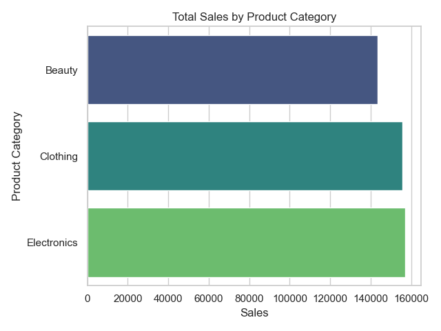

# 🛒 Retail Sales Analysis & Forecasting  
*Unlocking Insights from Transactions, Trends, and Time*


---

## 👋 Introduction

Hi, I'm **Thakgatso Choma**, an **Industrial Engineer** with a growing passion for **Data Engineering and Data Science**.  
This project reflects my journey of turning raw data into meaningful insights — combining analysis, storytelling, and machine learning in a real-world retail context.

---

## 📊 Project Overview

**Retail Sales Analysis** is a complete data science pipeline project based on real retail transaction data.  
It covers everything from cleaning and exploring the data to building visual insights and predicting future sales using machine learning.

### 🔍 What This Project Does:

- 🎯 Understand customer segments & trends
- 🛍️ Analyze product category performances
- 📅 Discover sales patterns across time
- 🔮 Forecast future sales using ML models

---

## 🧠 What I Learned

- ✅ Cleaning and preprocessing complex real-world data
- ✅ Exploring customer and product trends through EDA
- ✅ Creating clear, beautiful visualizations
- ✅ Building regression models to forecast daily sales
- ✅ Organizing a professional, reproducible Python project

---

## 📁 Project Structure

retail-sales-analysis/
├── data/ # Raw & processed data
├── notebooks/ # Step-by-step notebooks (EDA, cleaning, modeling)
├── reports/figures/ # All saved charts and images
├── src/ # Python modules for EDA, modeling, cleaning
├── README.md # You are here 👋
├── requirements.txt # Libraries used
└── .gitignore


---

## 📌 Dataset Summary

The dataset comes from [Kaggle](https://www.kaggle.com/datasets/mohammadtalib786/retail-sales-dataset) and includes:

| Column | Description |
|--------|-------------|
| `Transaction ID` | Unique order ID |
| `Date` | Purchase date |
| `Customer ID` | Unique buyer ID |
| `Gender`, `Age` | Demographics |
| `Product Category` | Electronics, Clothing, etc. |
| `Quantity`, `Price per Unit`, `Total Amount` | Transaction metrics |

---

## 🧪 Notebooks Overview

| Notebook | Purpose |
|----------|---------|
| `01_data_exploration.ipynb` | Initial inspection, types, shape, missing values |
| `02_data_cleaning.ipynb` | Standardizes column names, parses dates, handles missing & outliers |
| `03_visualization.ipynb` | Visual analysis: gender, age, category, sales trends |
| `04_modeling.ipynb` | Regression model to forecast daily sales |

---

## 📷 Visual Highlights

### 🛍️ Sales by Product Category



### 👥 Gender-Based Spending


### 📈 Sales Over Time


### 🔮 Forecasted Sales (vs Actual)


---

## 🔮 Forecasting Models

In `04_modeling.ipynb`, I trained a `LinearRegression` model to forecast total sales using time features like day of week, month, and holiday flags.

### 📌 Optional Extensions:

- Add **Prophet** to forecast using time series modeling
- Test advanced models like **XGBoost** for boosting performance

---

## 🧰 Tech Stack

| Tool | Purpose |
|------|---------|
| `pandas`, `numpy` | Data processing |
| `matplotlib`, `seaborn` | Visualization |
| `scikit-learn`, `xgboost`, `prophet` | Machine Learning |
| Jupyter, Git | Development & version control |

---

## 💡 Future Improvements

- [ ] Deploy as a dashboard (Streamlit or Flask)
- [ ] Add holiday-based seasonal effects (with Prophet)
- [ ] Automate pipeline using Airflow or Prefect

---

## ⚙️ Setup Instructions

1. **Clone the Repository**

```bash
git clone https://github.com/Thakgatso-Hlahlane-Choma/retail-sales-analysis.git
cd retail-sales-analysis
